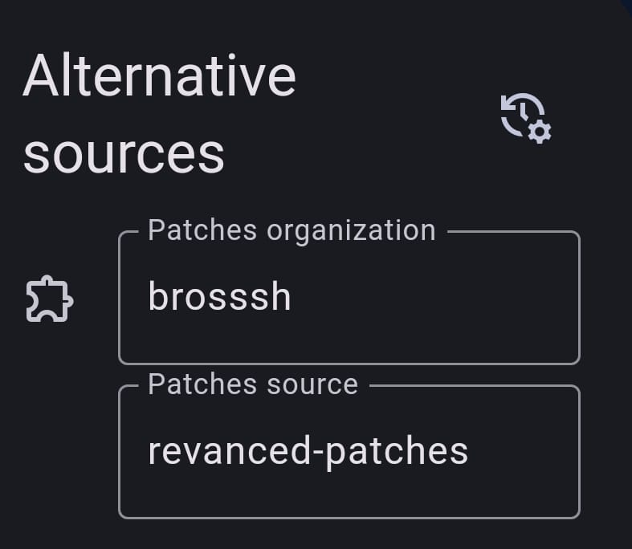

  <picture>
    <source
      width="256px"
      media="(prefers-color-scheme: dark)"
      srcset="assets/revanced-headline/revanced-headline-vertical-dark.svg"
    >
    
  </picture>
   
  <a href="https://revanced.app/">
     <picture>
         <source height="24px" media="(prefers-color-scheme: dark)" srcset="assets/revanced-logo/revanced-logo.svg" />
         
     </picture>
   </a>&nbsp;&nbsp;&nbsp;
   <a href="https://github.com/ReVanced">
       <picture>
           <source height="24px" media="(prefers-color-scheme: dark)" srcset="https://i.ibb.co/dMMmCrW/Git-Hub-Mark.png" />
           
       </picture>
   </a>&nbsp;&nbsp;&nbsp;
   <a href="http://revanced.app/discord">
       <picture>
           <source height="24px" media="(prefers-color-scheme: dark)" srcset="https://user-images.githubusercontent.com/13122796/178032563-d4e084b7-244e-4358-af50-26bde6dd4996.png" />
           
       </picture>
   </a>&nbsp;&nbsp;&nbsp;
   <a href="https://reddit.com/r/revancedapp">
       <picture>
           <source height="24px" media="(prefers-color-scheme: dark)" srcset="https://user-images.githubusercontent.com/13122796/178032351-9d9d5619-8ef7-470a-9eec-2744ece54553.png" />
           
       </picture>
   </a>&nbsp;&nbsp;&nbsp;
   <a href="https://t.me/app_revanced">
      <picture>
         <source height="24px" media="(prefers-color-scheme: dark)" srcset="https://user-images.githubusercontent.com/13122796/178032213-faf25ab8-0bc3-4a94-a730-b524c96df124.png" />
         
      </picture>
   </a>&nbsp;&nbsp;&nbsp;
   <a href="https://x.com/revancedapp">
      <picture>
         <source media="(prefers-color-scheme: dark)" srcset="https://user-images.githubusercontent.com/93124920/270180600-7c1b38bf-889b-4d68-bd5e-b9d86f91421a.png">
         
      </picture>
   </a>&nbsp;&nbsp;&nbsp;
   <a href="https://www.youtube.com/@ReVanced">
      <picture>
         <source height="24px" media="(prefers-color-scheme: dark)" srcset="https://user-images.githubusercontent.com/13122796/178032714-c51c7492-0666-44ac-99c2-f003a695ab50.png" />
         
     </picture>
   </a>
    
    
   Continuing the legacy of Vanced

# 👋🧩 Brosssh Fork of ReVanced Patches

My fork or ReVanced Patches.

## ❓ About

This repository contains patches I made for some [apps](https://github.com/Brosssh/revanced-patches/tree/main/patches/src/main/kotlin/app/revanced/patches) (like Komoot, Calistree and others).

If you don't know what ReVanced or a ReVanced Patch are, check [here](https://revanced.app/).

## 🚀 How to use my patches

These patches can be applied to your apps via the official [ReVanced Manager](https://github.com/revanced/revanced-manager).

⚠️**If you don't already know how to patch an app with ReVanced, please go check [their documentation](https://github.com/ReVanced/revanced-manager/tree/main/docs) first.** ⚠️

1. Open ReVanced Manager, go to Settings -> Data sources -> Turn on "Use alternative sources".
2. In the same section, click "Alternative sources".
3. Replace the organization (which by default is "*revanced*") to "*brosssh*".
4. Make sure the Patches source is "*revanced-patches*".
    
    
3. Save with OK and restart the app

🎉 You are now able to see and apply my patches!

## 📙 Issues or requests
If you have an issue or a suggestion, please open a GitHub Issue [here](https://github.com/Brosssh/revanced-patches/issues/new/choose).
You can also create a Pull Request if you want to make changes to my patches, but please create a [discussion](https://github.com/Brosssh/revanced-patches/issues/new/choose) first.

## 📜 Licence

My fork of ReVanced Patches is licensed under the GPLv3 licence, as the official [ReVanced Patches](https://github.com/ReVanced/revanced-patches).
Please see the [license file](LICENSE) for more information.
[tl;dr](https://www.tldrlegal.com/license/gnu-general-public-license-v3-gpl-3) you may copy, distribute
and modify ReVanced Patches template as long as you track changes/dates in source files.
Any modifications to ReVanced Patches template must also be made available under the GPL,
along with build & install instructions
